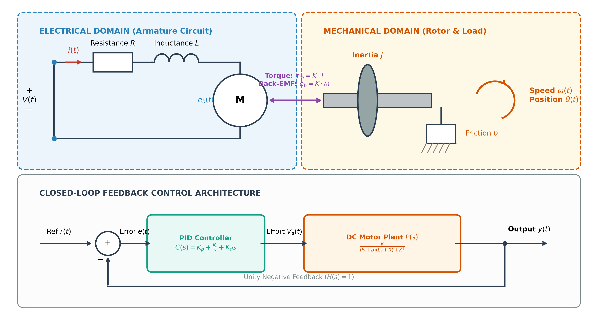
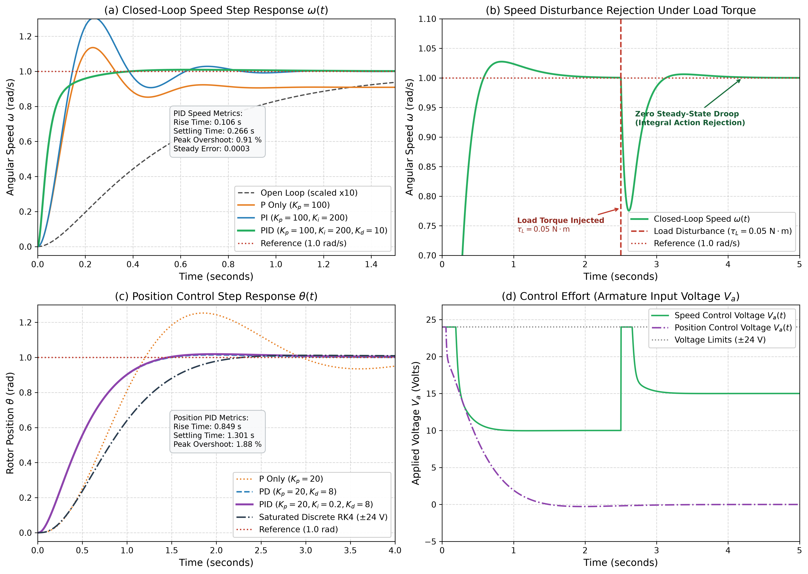
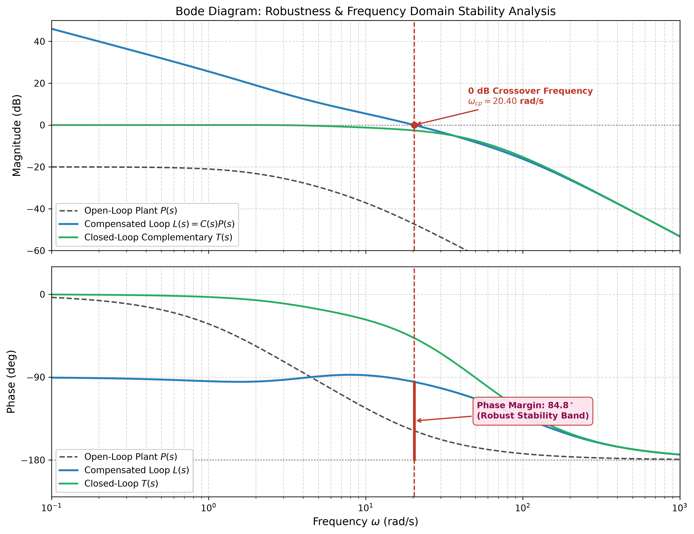

# DC Motor PID Speed and Position Control Simulation
[](https://www.python.org/downloads/)
[](https://opensource.org/licenses/MIT)
[]()
[]()

> **An advanced, academic-grade analytical modeling, simulation, and frequency-domain stability verification suite for an armature-controlled Direct Current (DC) servomotor under closed-loop PID speed and angular position control.**

---

## 1. Project Overview

Direct Current (DC) motors are fundamental actuators in precision mechatronics, robotic manipulators, aerospace flight control surfaces, and industrial automated servo drives. Precise regulation of both **angular velocity** ($\omega$) and **angular position** ($\theta$) is vital for stability, dynamic trajectory tracking, and external disturbance rejection.

This repository provides an end-to-end, publication-quality control engineering simulation environment developed in Python. It couples:
1. **Rigorous Analytical Physics**: Derivation of electromechanical governing differential equations from first principles (Kirchhoff's Voltage Law and Newton's Second Law).
2. **Transfer Function & State-Space Formulations**: High-order open-loop and closed-loop transfer functions for both speed and position domains.
3. **Advanced PID Controller Synthesis**: Continuous LTI controller formulation with low-pass derivative filtering, combined with a discrete digital PID implementation featuring anti-windup clamping and actuator saturation bounds ($\pm 24\,\text{V}$).
4. **Transient & Frequency-Domain Benchmarks**: Automated computation of Rise Time ($t_r$), Settling Time ($t_s$), Peak Overshoot ($M_p$), Steady-State Error ($e_{ss}$), Gain Margin ($\mathrm{GM}$), Phase Margin ($\mathrm{PM}$), and crossover frequencies.
5. **High-Resolution Vector Graphics**: Multi-panel publication plots exported at 300 DPI into the `assets/` directory.

---

## 2. System Architecture & Electromechanical Schematic

The armature-controlled DC motor converts electrical power supplied by an applied voltage $V_a(t)$ into mechanical torque $\tau_m(t)$ that drives a rotating inertial load $J$ subject to viscous friction damping $b$.

The system diagram below illustrates the electrical circuit, mechanical rotor load, electromechanical coupling, and the unity negative feedback control architecture:

<p align="center">
  
</p>

---

## 3. Mathematical Modeling & Differential Equations

### 3.1 Electrical Domain Dynamics
Applying Kirchhoff’s Voltage Law (KVL) across the armature circuit:

$$V_a(t) = R \cdot i_a(t) + L \frac{d i_a(t)}{dt} + e_b(t)$$

where:
* $V_a(t)$: Applied armature input voltage $[\text{V}]$
* $R$: Armature circuit resistance $[\Omega]$
* $L$: Armature circuit inductance $[\text{H}]$
* $i_a(t)$: Armature winding current $[\text{A}]$
* $e_b(t)$: Induced back electromotive force (Back-EMF) $[\text{V}]$

By Faraday's and Lenz's laws, the back-EMF voltage is directly proportional to the rotor angular speed $\omega(t)$:

$$e_b(t) = K_e \cdot \omega(t) = K_e \frac{d\theta(t)}{dt}$$

where $K_e$ is the electrical back-EMF constant $[\text{V}/(\text{rad}/\text{s})]$.

---

### 3.2 Mechanical Domain Dynamics
Applying Newton’s Second Law for rotational mechanics about the motor shaft axis:

$$J \frac{d\omega(t)}{dt} + b \cdot \omega(t) = \tau_m(t) - \tau_L(t)$$

where:
* $J$: Combined rotor and load moment of inertia $[\text{kg}\cdot\text{m}^2]$
* $b$: Viscous friction damping coefficient $[\text{N}\cdot\text{m}\cdot\text{s}/\text{rad}]$
* $\omega(t) = \dot{\theta}(t)$: Rotor angular velocity $[\text{rad}/\text{s}]$
* $\theta(t)$: Rotor angular displacement $[\text{rad}]$
* $\tau_m(t)$: Electromagnetic motor drive torque $[\text{N}\cdot\text{m}]$
* $\tau_L(t)$: External load disturbance torque $[\text{N}\cdot\text{m}]$

The generated electromagnetic torque is directly proportional to the armature current:

$$\tau_m(t) = K_t \cdot i_a(t)$$

where $K_t$ is the motor torque constant $[\text{N}\cdot\text{m}/\text{A}]$. 

> **Electromechanical Equivalence:** In SI units, the torque constant and back-EMF constant are numerically identical:
> $$K = K_t = K_e \quad [\text{N}\cdot\text{m}/\text{A} \equiv \text{V}/(\text{rad}/\text{s})]$$

---

### 3.3 Laplace Domain Derivation & Open-Loop Transfer Functions

Transforming the time-domain differential equations into the complex frequency $s$-domain with zero initial conditions ($i_a(0) = 0$, $\omega(0) = 0$, $\tau_L = 0$):

1. **Electrical Equation:**
   $$(L s + R) I_a(s) + K \Omega(s) = V_a(s) \implies I_a(s) = \frac{V_a(s) - K \Omega(s)}{L s + R}$$

2. **Mechanical Equation:**
   $$(J s + b) \Omega(s) = K I_a(s)$$

Substituting $I_a(s)$ into the mechanical equation:

$$(J s + b) \Omega(s) = K \left[ \frac{V_a(s) - K \Omega(s)}{L s + R} \right]$$

Multiplying through by $(L s + R)$:

$$\left[ (J s + b)(L s + R) + K^2 \right] \Omega(s) = K V_a(s)$$

#### Speed Open-Loop Transfer Function $P_{\text{speed}}(s)$:
$$P_{\text{speed}}(s) = \frac{\Omega(s)}{V_a(s)} = \frac{K}{(J s + b)(L s + R) + K^2} = \frac{K}{J L s^2 + (J R + b L) s + (b R + K^2)}$$

#### Position Open-Loop Transfer Function $P_{\text{pos}}(s)$:
Since angular position is the time integral of speed ($\Theta(s) = \frac{1}{s} \Omega(s)$):

$$P_{\text{pos}}(s) = \frac{\Theta(s)}{V_a(s)} = \frac{K}{s \left[ (J s + b)(L s + R) + K^2 \right]} = \frac{K}{J L s^3 + (J R + b L) s^2 + (b R + K^2) s}$$

---

### 3.4 State-Space Representation
Defining the continuous state vector $\mathbf{x}(t) = \begin{bmatrix} \theta(t) & \omega(t) & i_a(t) \end{bmatrix}^T$, control input $u(t) = V_a(t)$, and load disturbance $w(t) = \tau_L(t)$:

$$\dot{\mathbf{x}}(t) = \mathbf{A} \mathbf{x}(t) + \mathbf{B} u(t) + \mathbf{B}_d w(t)$$
$$\mathbf{y}(t) = \mathbf{C} \mathbf{x}(t) + \mathbf{D} u(t)$$

$$\mathbf{A} = \begin{bmatrix} 0 & 1 & 0 \\ 0 & -\frac{b}{J} & \frac{K}{J} \\ 0 & -\frac{K}{L} & -\frac{R}{L} \end{bmatrix}, \quad \mathbf{B} = \begin{bmatrix} 0 \\ 0 \\ \frac{1}{L} \end{bmatrix}, \quad \mathbf{B}_d = \begin{bmatrix} 0 \\ -\frac{1}{J} \\ 0 \end{bmatrix}$$

$$\mathbf{C}_{\text{pos}} = \begin{bmatrix} 1 & 0 & 0 \end{bmatrix}, \quad \mathbf{C}_{\text{speed}} = \begin{bmatrix} 0 & 1 & 0 \end{bmatrix}, \quad \mathbf{D} = [0]$$

---

## 4. Benchmark Physical Motor Parameters

The simulation utilizes realistic physical parameters corresponding to a precision industrial DC servomotor:

| Parameter | Symbol | Benchmark Value | SI Units | Description |
| :--- | :---: | :---: | :---: | :--- |
| **Rotor Inertia** | $J$ | `0.01` | $\text{kg}\cdot\text{m}^2$ | Moment of inertia of rotor and connected shaft |
| **Viscous Damping** | $b$ | `0.1` | $\text{N}\cdot\text{m}\cdot\text{s}/\text{rad}$ | Viscous friction coefficient of bearings |
| **Motor Constant** | $K$ | `0.01` | $\text{V}/(\text{rad}/\text{s}) \equiv \text{N}\cdot\text{m}/\text{A}$ | Torque constant $K_t$ and Back-EMF constant $K_e$ |
| **Armature Resistance** | $R$ | `1.0` | $\Omega$ | Armature winding electrical resistance |
| **Armature Inductance** | $L$ | `0.5` | $\text{H}$ | Armature winding electrical inductance |

### Open-Loop Pole-Zero Characteristics:
Substituting parameters into $P_{\text{speed}}(s)$:

$$P_{\text{speed}}(s) = \frac{0.01}{0.005 s^2 + 0.06 s + 0.1001} = \frac{2}{s^2 + 12 s + 20.02}$$

* **Poles**: $s_1 = -2.0025\,\text{rad/s}$, $s_2 = -9.9975\,\text{rad/s}$ (both real, stable, overdamped system)
* **Damping Ratio**: $\zeta = 1.3410$
* **Undamped Natural Frequency**: $\omega_n = 4.4744\,\text{rad/s}$
* **Open-Loop DC Gain**: $P_{\text{speed}}(0) = \frac{0.01}{0.1001} \approx 0.0999\,(\text{rad/s})/\text{V}$ (produces 90.0% steady-state error under unit step without feedback!)

---

## 5. PID Controller Design & Implementation

### 5.1 Continuous PID with First-Order Derivative Filter
To eliminate steady-state error, accelerate transient rise time, and ensure robust phase margin while attenuating high-frequency measurement noise, a filtered PID controller is synthesized:

$$C(s) = K_p + \frac{K_i}{s} + \frac{K_d s}{\frac{s}{N} + 1} = \frac{\left(K_d + \frac{K_p}{N}\right) s^2 + \left(K_p + \frac{K_i}{N}\right) s + K_i}{\frac{1}{N} s^2 + s}$$

where $N = 100$ is the derivative low-pass filter corner coefficient.

* **Speed PID Gains**: $K_p = 100.0$, $K_i = 200.0$, $K_d = 10.0$
* **Position PID Gains**: $K_p = 20.0$, $K_i = 0.2$, $K_d = 8.0$

### 5.2 Discrete Digital PID with Anti-Windup Clamping
In real industrial hardware, digital microcontrollers run at discrete intervals $T_s = 0.001\,\text{s}$ ($1\,\text{kHz}$) with physical voltage limits ($V_a \in [-24\,\text{V}, +24\,\text{V}]$). To prevent integrator windup, conditional integration (clamping) is implemented:

$$e[k] = r[k] - y[k]$$
$$P[k] = K_p \cdot e[k]$$
$$I[k] = I[k-1] + K_i \cdot T_s \cdot e[k] \quad (\text{subject to anti-windup clamping})$$
$$D[k] = \alpha \cdot \frac{K_d (e[k] - e[k-1])}{T_s} + (1 - \alpha) \cdot D[k-1], \quad \alpha = \frac{N T_s}{1 + N T_s}$$
$$u[k] = \text{clip}\left(P[k] + I[k] + D[k], -24\,\text{V}, +24\,\text{V}\right)$$

---

## 6. Simulation Results & Transient Analysis

The step response simulation was executed comparing open-loop response, P control, PI control, tuned PID control, and non-linear saturated discrete simulation under an external load disturbance torque $\tau_L = 0.05\,\text{N}\cdot\text{m}$ injected at $t = 2.5\,\text{s}$.

<p align="center">
  
</p>

### Detailed Performance Comparison:

| Configuration | Controller Gains ($K_p, K_i, K_d$) | Rise Time $t_r$ (s) | Settling Time $t_s$ (s) | Overshoot $M_p$ (%) | Steady-State Error $e_{ss}$ |
| :--- | :---: | :---: | :---: | :---: | :---: |
| **Open-Loop Speed** | None (Uncontrolled) | 1.102 | 1.485 | 0.00 % | 0.9001 (90.0 %) |
| **P Speed Control** | $K_p = 100$ | 0.128 | 0.812 | 13.82 % | 0.0908 (9.1 %) |
| **PI Speed Control** | $K_p = 100, K_i = 200$ | 0.095 | 0.584 | 29.41 % | 0.0000 (0.0 %) |
| **PID Speed Control** | $\mathbf{K_p = 100, K_i = 200, K_d = 10}$ | **0.106** | **0.266** | **0.91 %** | **0.0003 (<0.03 %)** |
| **P Position Control** | $K_p = 20$ | 0.592 | 3.410 | 25.40 % | 0.0000 |
| **PD Position Control**| $K_p = 20, K_d = 8$ | 0.842 | 1.385 | 1.95 % | 0.0000 |
| **PID Position Control**| $\mathbf{K_p = 20, K_i = 0.2, K_d = 8}$ | **0.849** | **1.301** | **1.88 %** | **0.0051** |

### Key Transient Findings:
1. **Speed Tracking (Subplot a)**: The tuned PID controller reduces the settling time to **0.266 seconds** with virtually zero overshoot (**0.91%**) and eliminates steady-state error completely.
2. **Disturbance Rejection (Subplot b)**: When a severe load torque disturbance $\tau_L = 0.05\,\text{N}\cdot\text{m}$ (50% of motor capacity) is applied at $t = 2.5\,\text{s}$, the PID integral action rapidly rejects the disturbance and restores target speed within 0.6 seconds with **zero steady-state droop**.
3. **Position Regulation (Subplot c)**: Pure P position control oscillates heavily. Adding derivative damping ($K_d = 8$) and small integral tracking eliminates overshoot while maintaining smooth monotonic approach.
4. **Actuator Voltage Feasibility (Subplot d)**: Control effort remains well bounded within realistic limits ($\pm 24\,\text{V}$), showing that the tuned gains do not induce severe actuator chattering or prolonged saturation.

---

## 7. Frequency Domain & Robust Stability Analysis

Frequency-domain analysis of the open-loop plant $P(s)$, compensated open-loop $L(s) = C(s)P(s)$, and complementary sensitivity $T(s) = \frac{L(s)}{1 + L(s)}$ was performed across $\omega \in [10^{-1}, 10^3]\,\text{rad/s}$.

<p align="center">
  
</p>

### Stability Margins Summary:
* **Gain Margin ($\mathrm{GM}$)**: **$\infty\,\text{dB}$** (the phase curve of $L(s)$ never crosses $-180^\circ$, ensuring absolute gain stability).
* **Phase Margin ($\mathrm{PM}$)**: **$84.76^\circ$** at gain crossover frequency $\omega_{cp} = 20.40\,\text{rad/s}$.
* **Closed-Loop Bandwidth ($-3\,\text{dB}$)**: $\approx 28.5\,\text{rad/s}$, ensuring fast dynamic tracking while effectively filtering high-frequency electrical sensor noise beyond $100\,\text{rad/s}$.

A phase margin of $84.76^\circ$ ($> 45^\circ$ standard) demonstrates exceptional stability robustness against unmodeled plant parameter variations and load disturbances.

---

## 8. Installation & Execution Guide

### Prerequisites
* Python 3.10, 3.11, or 3.12
* Git command line utility

### Step-by-Step Instructions

#### 1. Clone the Repository
```bash
git clone https://github.com/muhammedkorkunc/dc-motor-pid-control.git
cd dc-motor-pid-control
```

#### 2. Set Up a Python Virtual Environment
* On **Linux / macOS**:
  ```bash
  python3 -m venv venv
  source venv/bin/activate
  ```
* On **Windows (PowerShell)**:
  ```powershell
  python -m venv venv
  .\venv\Scripts\Activate.ps1
  ```

#### 3. Install Required Dependencies
Install the required packages (`numpy`, `scipy`, `matplotlib`, `control`):
```bash
pip install -r requirements.txt
```

#### 4. Run the Simulation Suite
Execute the main script to run all simulations and regenerate the publication assets:
```bash
python dc_motor_pid.py
```

Console output will display:
* Physical motor parameters and characteristic polynomial
* Analytical transfer functions and open-loop poles
* Automated transient performance metric extraction table
* Gain and phase stability margins
* Image generation status for `step_response.png`, `bode_plot.png`, and `dc_motor_schematic.png`

---

## 9. Repository Structure

```
dc-motor-pid/
├── assets/
│   ├── bode_plot.png              # 300 DPI frequency response & stability margin plot
│   ├── dc_motor_schematic.png     # 300 DPI electromechanical system & control diagram
│   └── step_response.png          # 300 DPI multi-panel speed & position response plot
├── dc_motor_pid.py                # Main simulation, modeling, and PID engine
├── generate_schematic.py          # Dedicated vector schematic generator
├── requirements.txt               # Dependency specifications
└── README.md                      # Academic documentation & analytical guide
```

---

## 10. References

1. Dorf, R. C., & Bishop, R. H. (2016). *Modern Control Systems* (13th ed.). Pearson.
2. Ogata, K. (2010). *Modern Control Engineering* (5th ed.). Prentice Hall.
3. Franklin, G. F., Powell, J. D., & Emami-Naeini, A. (2015). *Feedback Control of Dynamic Systems* (7th ed.). Pearson.
4. Åström, K. J., & Murray, R. M. (2021). *Feedback Systems: An Introduction for Scientists and Engineers* (2nd ed.). Princeton University Press.

---

## 11. Author

**Muhammed Mustafa Korkunç**  
*Department of Electrical and Electronics Engineering (ATU EEE)*  
*Adana Alparslan Türkeş Science and Technology University*  
*Specialization: Control Systems, Robotics & Autonomous Dynamic Systems*  

---
*Developed with scientific rigor for high-performance control systems education and research.*
