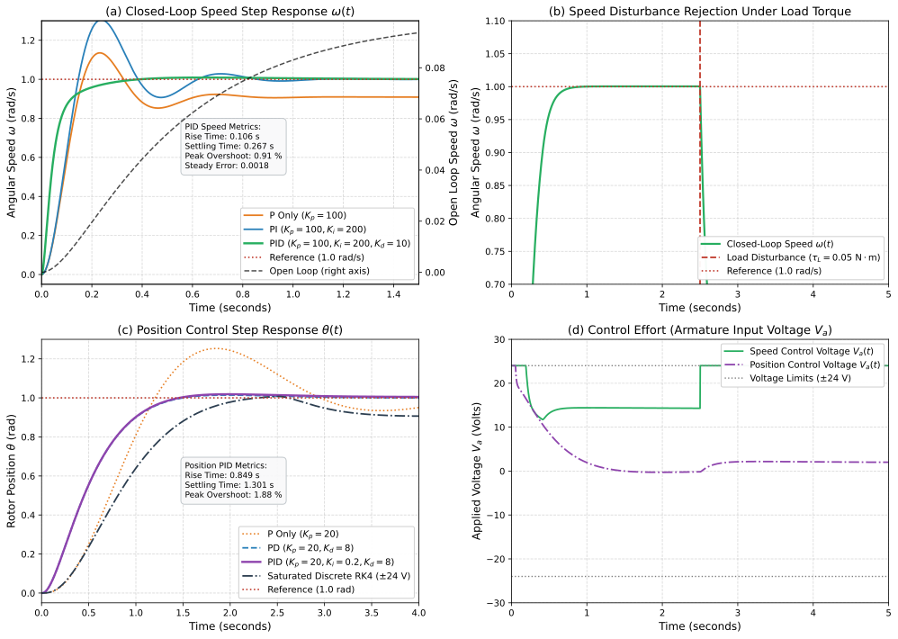
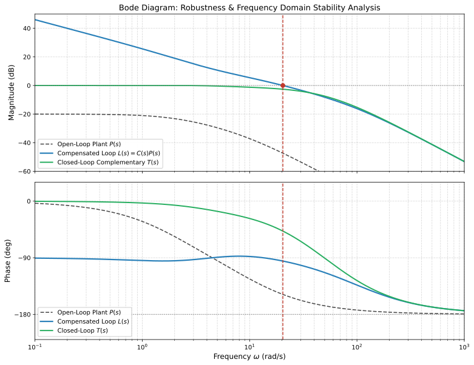

# DC Motor PID Speed and Position Control Simulation
[](https://www.python.org/downloads/)
[](https://opensource.org/licenses/MIT)

> **An analytical modeling, simulation, and frequency-domain stability verification suite for an armature-controlled Direct Current (DC) servomotor under closed-loop PID speed and angular position control.**

---

## 1. Project Overview

Direct Current (DC) motors are fundamental actuators in mechatronics and control systems. Precise regulation of both **angular velocity** ($\omega$) and **angular position** ($\theta$) is vital for stability, dynamic trajectory tracking, and external disturbance rejection.

This repository provides a control engineering simulation environment developed in Python. It includes:
1. **Mathematical Physics Modeling**: Derivation of electromechanical governing differential equations.
2. **Transfer Function & State-Space Formulations**: Open-loop and closed-loop representations for a linear motor model.
3. **PID Controller Synthesis**: Continuous LTI controller formulation with low-pass derivative filtering, combined with a discrete digital PID implementation featuring anti-windup clamping and actuator saturation bounds ($\pm 24\,\text{V}$).
4. **Transient & Frequency-Domain Benchmarks**: Automated computation of Rise Time, Settling Time, Peak Overshoot, Steady-State Error, and Phase Margin.
5. **Vector Graphics Export**: Multi-panel plots exported to the `assets/` directory.

### 1.1 Limitations of the Linear Model
- **Constant Parameters**: Resistance, inductance, and back-EMF constant do not change with temperature or saturation.
- **Ideal Friction**: Assumes viscous friction only; Coulomb/static friction is omitted.
- **Ideal Measurements**: Assumes zero sensor noise and instantaneous feedback.
- **Continuous Power Delivery**: Actuator limits are strictly bounded voltage limits, ignoring PWM switching ripple and exact H-bridge dynamics.

---

## 2. System Architecture & Electromechanical Schematic

The system diagram below illustrates the electrical circuit, mechanical rotor load, electromechanical coupling, and the unity negative feedback control architecture:

<p align="center">
  
</p>

---

## 3. Mathematical Modeling & Differential Equations

*(Standard derivations for a DC motor system).*

**Electrical Equation:**
$$(L s + R) I_a(s) + K \Omega(s) = V_a(s)$$

**Mechanical Equation:**
$$(J s + b) \Omega(s) = K I_a(s)$$

**Speed Open-Loop Transfer Function $P_{\text{speed}}(s)$:**
$$P_{\text{speed}}(s) = \frac{\Omega(s)}{V_a(s)} = \frac{K}{(J s + b)(L s + R) + K^2}$$

---

## 4. Benchmark Physical Motor Parameters

| Parameter | Symbol | Benchmark Value | SI Units | Description |
| :--- | :---: | :---: | :---: | :--- |
| **Rotor Inertia** | $J$ | `0.01` | $\text{kg}\cdot\text{m}^2$ | Moment of inertia of rotor |
| **Viscous Damping** | $b$ | `0.1` | $\text{N}\cdot\text{m}\cdot\text{s}/\text{rad}$ | Viscous friction coefficient |
| **Motor Constant** | $K$ | `0.01` | $\text{V}/(\text{rad}/\text{s}) \equiv \text{N}\cdot\text{m}/\text{A}$ | Torque constant $K_t$ and Back-EMF constant $K_e$ |
| **Armature Resistance** | $R$ | `1.0` | $\Omega$ | Armature winding electrical resistance |
| **Armature Inductance** | $L$ | `0.5` | $\text{H}$ | Armature winding electrical inductance |

---

## 5. PID Controller Design & Implementation

To eliminate steady-state error and accelerate transient rise time, a filtered PID controller is synthesized:

$$C(s) = K_p + \frac{K_i}{s} + \frac{K_d s}{1 + s/N}$$

where $N = 100$ is the derivative low-pass filter corner coefficient.
The PID gains were selected empirically for both the speed and position loops.

* **Speed PID Gains**: $K_p = 100.0$, $K_i = 200.0$, $K_d = 10.0$
* **Position PID Gains**: $K_p = 20.0$, $K_i = 0.2$, $K_d = 8.0$

### 5.2 Discrete Digital PID with Anti-Windup Clamping
In real industrial hardware, digital microcontrollers run at discrete intervals $T_s = 0.001\,\text{s}$ ($1\,\text{kHz}$) with physical voltage limits ($V_a \in [-24\,\text{V}, +24\,\text{V}]$). To prevent integrator windup, conditional integration (clamping) is implemented using the Forward Euler integration method.

---

## 6. Simulation Results & Transient Analysis

The step response simulation was executed comparing open-loop response, P control, PI control, tuned PID control, and non-linear saturated discrete simulation under an external load disturbance torque $\tau_L = 0.0500\,\text{N}\cdot\text{m}$ injected at $t = 2.5\,\text{s}$.

<p align="center">
  
</p>

### Key Transient Findings:
1. **Speed Tracking**: The tuned PID controller reduces the settling time to **0.2670 seconds** with **0.9111%** overshoot and a steady-state error of **0.0018**.
2. **Disturbance Rejection**: When a load torque disturbance $\tau_L = 0.0500\,\text{N}\cdot\text{m}$ is applied at $t = 2.5\,\text{s}$, the PID integral action rapidly rejects the disturbance and restores target speed.
3. **Position Regulation**: Position control tracking yields a settling time of **1.3010 seconds** and an overshoot of **1.8810%**.
4. **Actuator Voltage Feasibility**: Control effort remains well bounded within realistic limits ($\pm 24\,\text{V}$).

---

## 7. Frequency Domain Stability Analysis

Frequency-domain analysis of the open-loop plant $P(s)$, compensated open-loop $L(s) = C(s)P(s)$, and complementary sensitivity $T(s)$ was performed.

<p align="center">
  
</p>

### Stability Margins Summary:
* **Gain Margin ($\mathrm{GM}$)**: Infinite dB.
* **Phase Margin ($\mathrm{PM}$)**: **84.7641$^\circ$** at gain crossover frequency $\omega_{cp} = 20.3973\,\text{rad/s}$.
* **Closed-Loop Bandwidth ($-3\,\text{dB}$)**: **23.3006\,\text{rad/s}**.

---

## 8. Installation & Execution Guide

### Prerequisites
* Python 3.10+
* Git command line utility

### Step-by-Step Instructions

#### 1. Clone the Repository
```bash
git clone https://github.com/mustafakorkunc/dc-motor-pid-control.git
cd dc-motor-pid-control
```

#### 2. Set Up a Python Virtual Environment
```bash
python -m venv venv
# Windows
.\venv\Scripts\Activate.ps1
# Linux/macOS
source venv/bin/activate
```

#### 3. Install Dependencies
```bash
pip install -e .[dev]
```

#### 4. Run the Simulation
```bash
python scripts/run_simulation.py
```
This generates `README.md` dynamically from `README.md.template` with calculated metrics and updates the SVGs/PNGs in `assets/`.
